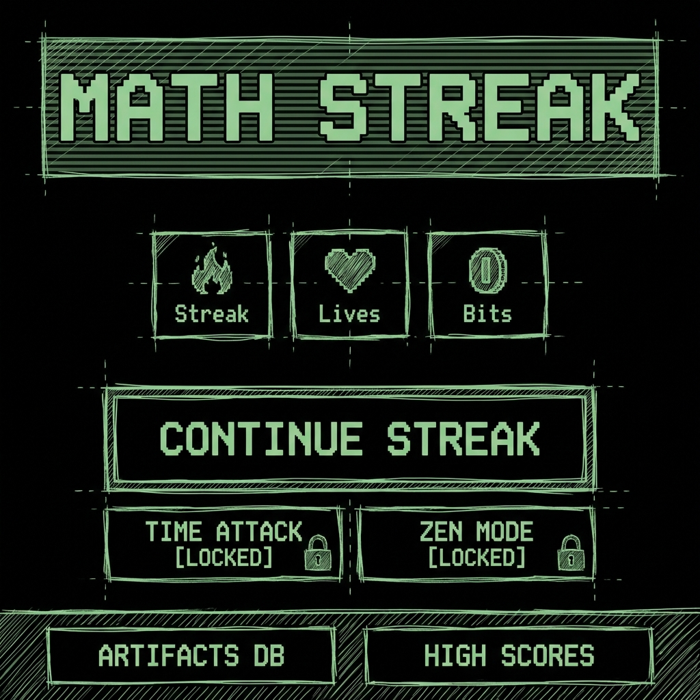
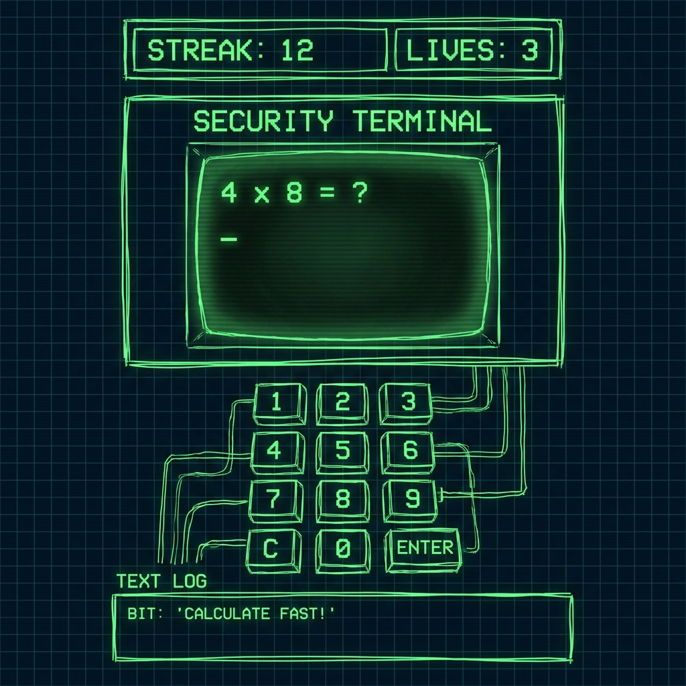
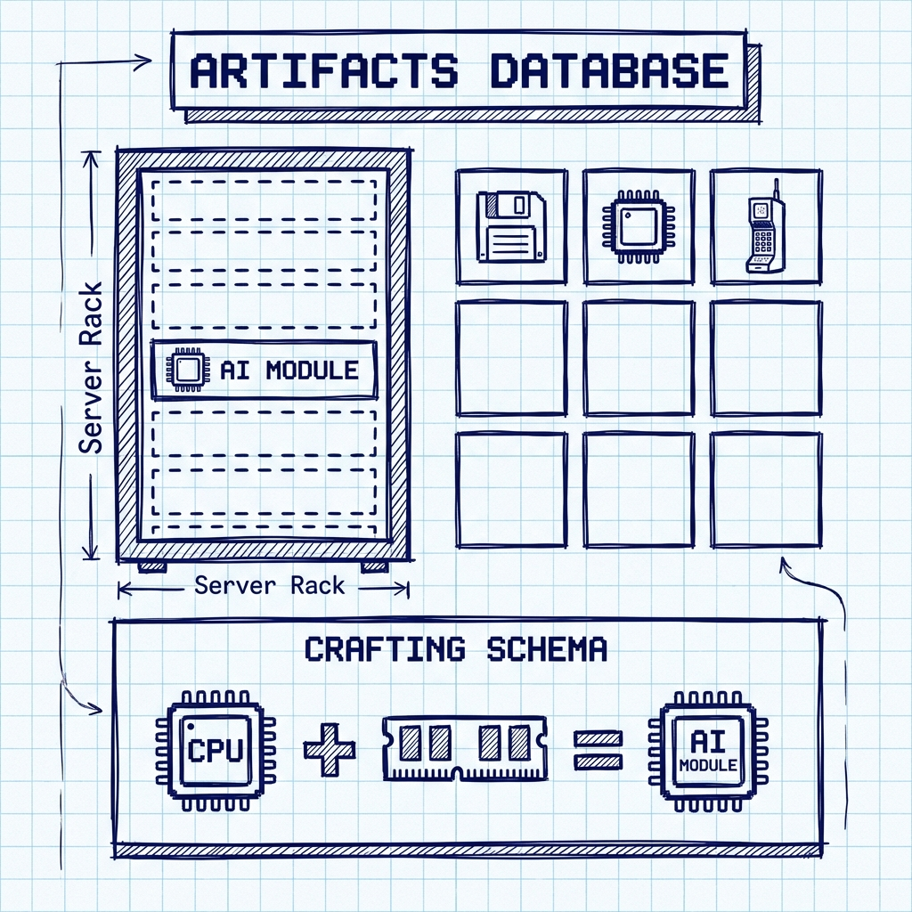

# Project: MathStreak - Animator & Artist Brief

## 1. Project Overview

**MathStreak** is a mobile game that combines a daily mental math challenge with a retro-tech RPG progression system.
**Vibe:** Using a computer terminal from 1985 to hack into the future.
**Core Loop:** Solve ONE equation per day -> Maintain "Streak" -> Earn "Bits" -> Upgrade your hardware (Server Rack).
**Secondary Modes:** "Time Attack" (rapid fire) and "Zen Mode" (endless mining) available for Pro users.

## 2. Story Overview

You are a **Data Archaeologist** in a digital wasteland. The "Old Internet" has collapsed, and knowledge is fragmented into corrupted sectors.
Your tool is the **MathStreak Terminal**, a device capable of decoding these fragments through pure logic (math).
As you solve equations, you rebuild the world's database, uncover "Artifacts" from the past (Nokias, Floppy Disks, Memes), and upgrade your rig from a dusty 8-bit monitor to a futuristic supercomputer.
**Bit**, a glitched AI fragment, guides you—claiming he used to be a powerful search engine but now just wants to play Snake.

## 2. Visual Style Guide

The visual direction is **"Evolving Retro Tech"**.

- **Color Palette:** High-contrast Terminal Green (`#00FF00`) on Deep Black (`#000000`).
- **Typography:** Monospace, Pixel fonts (e.g., Press Start 2P, VT323).
- **Effects:** CRT scanlines, chromatic aberration, screen flicker, phosphor glow.
- **Eras (Concept):** The game visually evolves, but not strictly linearly. The UI should match the "era" of the content or cycle dynamically to keep engagement high.
  - *Concept 1 (Early):* 8-bit / Monochrome CRT (Apple II, Commodore 64).
  - *Concept 2 (Mid):* 16-bit / Classic Console (Purple/Gold SNES style).
  - *Concept 3 (Modern):* High-fidelity Mobile Game UI (Clean vector, rounded glass).
    *Note: These are loose suggestions. We encourage exploring a wide range of retro console aesthetics. The system might "glitch" between these styles during gameplay.*

## 3. Character Bio: "Bit"

**Bit** is the player's AI companion.

- **Appearance:** A sentient floating pixel grid or fireball.
- **Personality:** Sarcastic, helpful but condescending, breaks the fourth wall.
- **Role:** Acts as the tutorial guide and notifies the player of events.
- **Animation Needs:** Idle (pulsing), Happy (jumping), Glitch (distorted).

## 4. Screen Breakdown & Wireframes

### A. Home Screen

The control center. Needs to feel alive and buzzing.

- **Elements:** Play Button, Stats (Lives, Streak), Mode Select.
- **Required Animations:** Pulsing "Press Start", CRT turn-on effect when app opens.

### B. Game Screen (The Terminal)

The core action. A "Hacking Terminal" interface.

- **Elements:** Equation display (`4 x 4 = ?`), Keypad, Timer bar.
- **Required Animations:**
  - Correct Answer: Green flash, sparks, screen shake.
  - Wrong Answer: Red glitch, screen "tear", system error popup.

### C. Trophy & Crafting Screen

The progression hub.

- **Elements:** Server Rack (visual representation of progress), Inventory Grid.
- **Required Animations:**
  - Item Drop: Loot crate opening or file download bar filling up.
  - Upgrade: Server rack transforming/evolving (e.g., adding blinking lights).

### D. Map Screen & Cutscenes

Visualizing the network of "corrupted sectors" the player is repairing.

- **Map:** A node-based network view (like a skill tree or star map).
- **Cutscenes:** Static or lightly animated interludes for major milestones (e.g., Unlocking a new Era, defeating a Boss Node).
- **Style:** Blueprint / Radar aesthetic.

## 5. Asset Request List

### Game Mode Styling

Each mode needs a distinct visual identity within the current Era:

1. **Daily Challenge (Standard):** Classic "Terminal Green" (Monochrome/Phosphor).
2. **Time Attack (Panic):** "System Failure Red" (High contrast, aggressive glitches, sirens).
3. **Zen Mode (Relax):** "Deep Blue / Ice" (Flowing, calm, ambient).

### UI & HUD

*Note: All UI elements must adapt to the current Era (e.g., 8-bit buttons -> 16-bit sprites -> Modern Glassmorphism).*

- [ ] **Custom Keypad Buttons:** Normal, Pressed, and Disabled states.
- [ ] **Icons:** Heart (Lives), Flame (Streak), Coin (Bits).
- [ ] **Borders:** Terminal window borders.

### VFX (Sprite Sheets or Lottie)

- [ ] **Success Burst:** An "apocalyptic celebration." Think nuclear shockwaves, electric overload, or Matrix-style code explosions. NOT generic confetti.
- [ ] **Glitch Effect:** A screen distortion overlay for damage/errors.
- [ ] **Loot Box Open:** An animation of a "zip file" unzipping or a crate opening to reveal an item.
- [ ] **Map Assets:** Nodes (Locked, Unlocked, Completed) and connecting lines.
- [ ] **Cutscene Frames/Animations:**
  - **Era Transitions:** 3-4 key art frames (e.g., 8-bit to 16-bit evolution).
  - **Gameplay Transitions:** Short, punchy animations for "Booting Up" a daily challenge and "Uploading Results" after completion. Make the math feel like a mission.

### Store & Marketing Assets

- [ ] **App Icon:** The face of the game. Needs to stand out on a home screen. (1024x1024).
- [ ] **Splash Screen:** The first thing players see. "Deepmind Corp" logo or "MathStreak" title card with a cool CRT turn-on effect.
- [ ] **Feature Graphic:** Landscape artwork for the App Store/Play Store page. Action shot of the Terminal + Bit + Loot.
- [ ] **Social Banners:** Headers for Twitter/YouTube to build hype pre-launch.

### Character

- [ ] **Bit (The AI):** 3-4 loopable states (Idle, Talk, Celebrate, Panic).

## 6. Technical Constraints

- **File Formats:** Lottie (JSON) preferred for UI animations; PNG sequences for heavy VFX.
- **Resolution:** Design for mobile portrait (1080x1920 reference).
- **Style Consistency:** Assets should be consistent *within their specific era*.
  - *Early Era:* Strict pixel grid.
  - *Mid Era:* Low-poly 3D / 16-bit.
  - *Late Era:* HD Vectors / Modern UI.
